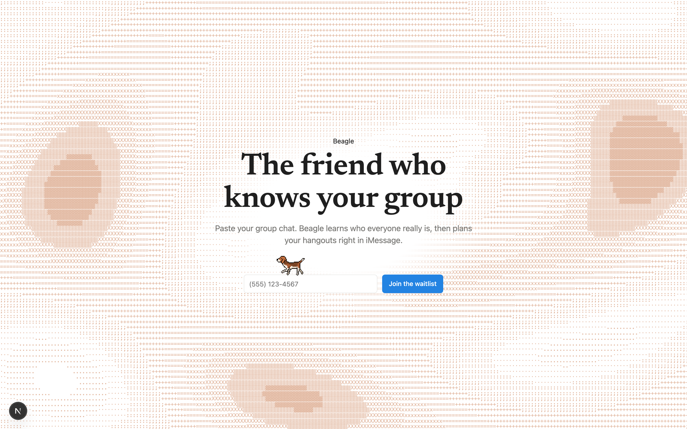
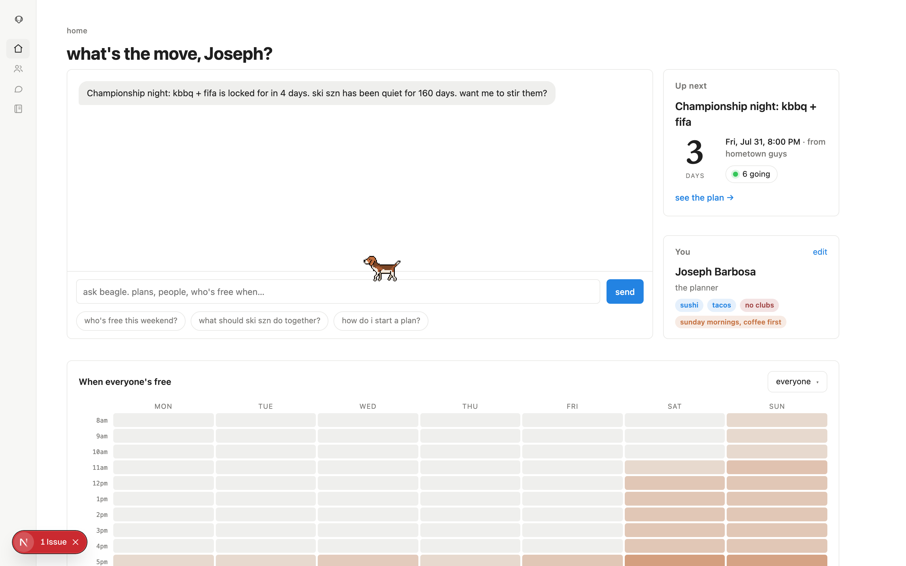
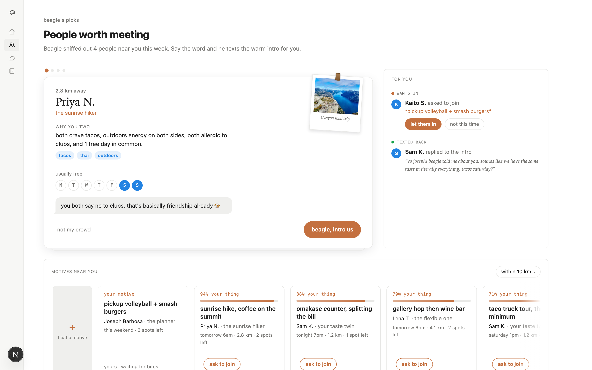
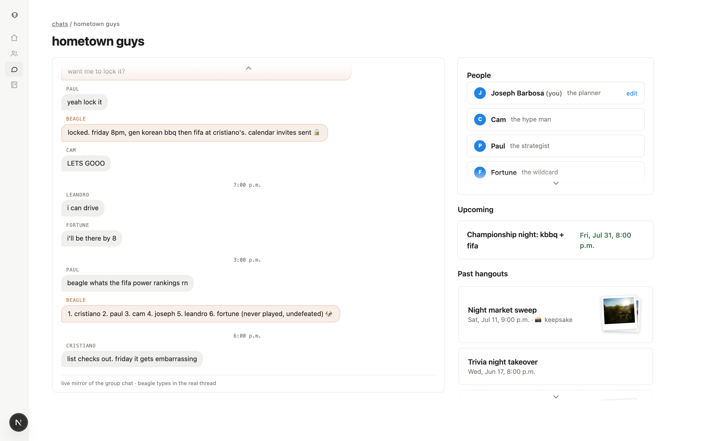
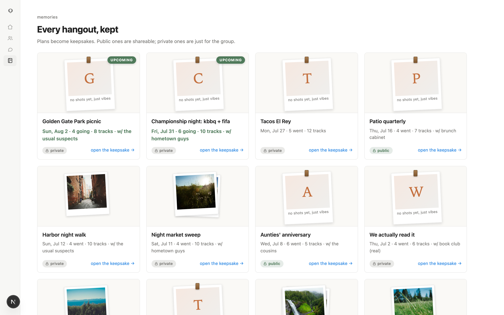
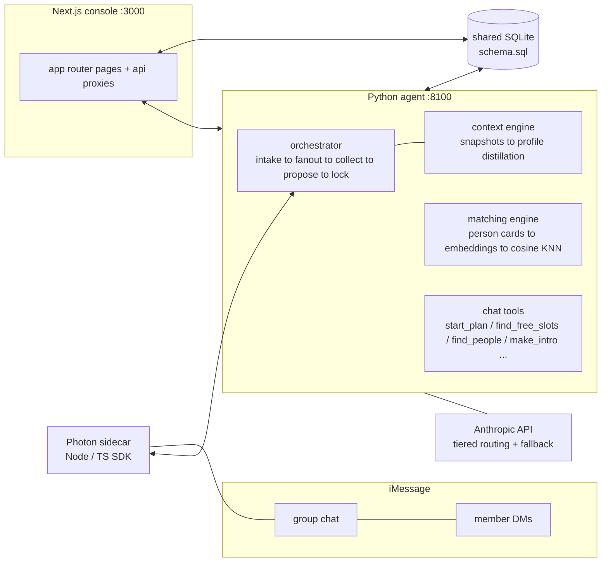

# Beagle 🐶

**The friend who knows your group — and helps it grow.**

Beagle is an iMessage-native social planning agent. You add it to a group chat
like a friend; when someone says the word, it DMs everyone for constraints,
finds the overlap, proposes a plan, locks it, and sends the invites — then
keeps the memory afterward. A companion web console gives every member a
mission-control view of their social life: live chat with the agent, a
group-wide availability heatmap, curated friend matching, same-day "motives",
and a keepsake archive of every hangout.

Built for the YC Startup School hackathon; grown well past it.

> **Status**: waitlist-open. The hosted site serves the landing page and
> waitlist only — the app itself isn't public yet.



## What it does

**In the group chat (the product's core):**
- Group-first trigger: "@beagle find us something" in the thread
- Multi-turn DM collection: texts each member, extracts constraints
  conversationally (time, budget, hard nos), no forms
- Conversational propose → lock: picks a venue + time everyone can make,
  confirms in-thread, sends calendar invites
- Context engine: snapshots every conversation window, distills it into
  evolving member profiles (tastes, availability rhythms, personas)
- Quiet-chat nudges: notices when a group goes cold and stirs it

**In the console:**

| Surface | What it is |
|---|---|
| **Home** | Free-form chat with the agent (it has real tools: start plans, compute exact free windows, search venues, text intros), an up-next countdown, a gcal-style availability heatmap with drag-to-see-who's-free, and a polaroid string of memories |
| **Social** | Curated friend matching ("sniff reports") powered by semantic KNN over person embeddings; swiping right has the agent text a warm intro for real. Below it, **motives**: same-day intents from people nearby, scored against you, join-able in one tap |
| **Chats** | Every group the agent lives in, with a live read-only mirror of the actual thread |
| **Memories** | Every hangout kept as a keepsake: photos as flip-through polaroid stacks, the blend playlist, the agent's memory note, post-its |






## Architecture



- **Agent** (Python / FastAPI): the orchestrator runs planning sessions as a
  conversational state machine; every LLM call goes through a tiered router
  (cheap/frontier) with cross-tier fallback and cost logging. The home chat is
  a real tool-use loop over the official Anthropic SDK — the agent doesn't
  describe actions, it takes them.
- **Matching** is retrieval done properly: profiles serialize to natural-
  language person cards, embedded (fastembed/ONNX, cached in SQLite by content
  hash), gated (geo, not-already-connected), cosine-ranked, then the LLM
  explains the match instead of scoring it. Offline fallback is a
  deterministic taste-vector cosine, so everything runs with zero keys.
- **Web** (Next.js 15 App Router): server components over the same SQLite
  seam, with typed attachment rendering for agent tool output (slot chips,
  venue cards, intro dossiers).
- **Transport**: a Node sidecar wraps Photon's TS-only iMessage SDK. In dev,
  `SIDECAR_FAKE=1` swaps in a full fake transport — the entire product runs
  end-to-end with no carrier and no API keys.

## Run it locally

```bash
# 1. agent
python3 -m venv .venv && source .venv/bin/activate && pip install -e .
cp .env.example .env                       # everything optional for demo mode

# 2. seed a living demo world (fictional 555 numbers throughout)
cd web && npm install && node scripts/seed-photos.mjs && node scripts/seed.mjs && cd ..

# 3. start
SIDECAR_FAKE=1 .venv/bin/uvicorn src.main:app --port 8100   # the agent
cd web && npm run dev                                        # the console

# 4. sign in at localhost:3000/login as +1 647 555 0132 (demo Joseph;
#    password is decorative)
```

Tests: `python -m pytest src` (agent) and `cd web && npx vitest run` (web).

**Safety by construction**: every seeded number uses the fictional 555
exchange, so no code path can ever text a real stranger. For a live iMessage
run you swap real, allowlisted numbers in locally (never committed), and
`BEAGLE_INTRO_TARGET` reroutes all outbound intros to one consenting phone.

## Deploying the waitlist (launch posture)

The rollout ships the landing page only. Set two env vars on any Next.js
host (Vercel works out of the box):

```
WAITLIST_ONLY=1                 # middleware serves only / and /api/waitlist
WAITLIST_DATABASE_URL=postgres://...   # any Postgres (Neon/RDS/Vercel)
```

Every other route — console pages, login, agent APIs — redirects home. The
waitlist stores E.164-normalized phone numbers with the phone as primary key
(duplicates impossible at the storage layer), and the same code runs on local
SQLite with zero config for development.

## Repo map

```
src/agent/       orchestrator, context engine, matching, tools, workers
src/contracts.py typed ports + models (the seam between everything)
schema.sql       shared SQLite schema
sidecar/         Node wrapper for the Photon iMessage SDK (+ fake transport)
web/             Next.js console (landing, home, social, chats, memories)
web/scripts/     one-command demo-world seed (people, groups, threads, photos)
docs/            PRD + branch docs
```
